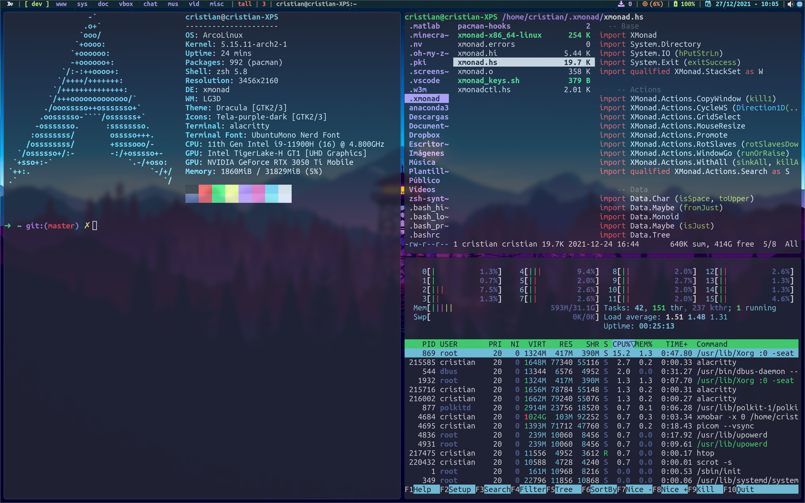

# dotfiles - Cristian Valero Abundio
## Config files for your Linux.

In this repository you can find various configurations to configure your Linux operating system, preferably ArchLinux and its derivatives like Manjaro, Arco Linux...

- Xresources (for 4k screen)
- Xmonad
- Xmonad
- Xmobar
- Qtile
- Scripts for automation
- zsh / oh-my-zsh



## Installation

Clone the repository and start having fun!

```sh
# First, install packages and dependencies
sudo pacman -S xmonad xmonad-contrib xmobar trayer xdotool
yay -S nerd-fonts-ubuntu-mono

# Clone this respository and copy my configs
git clone https://github.com/CristianValero/dotfiles.git
cd dotfiles/
```
Xmobar will not work if you don't have my ~/.local/bin scripts.
```sh
cp -r dotfiles/.local/bin/* ~/.local/bin/

# These scripts have some dependencies
sudo pacman -S pacman-contrib brightnessctl pamixer upower network-manager-applet trayer
```

## Plugins

My ZSH / oh-my-zsh configurations needs some plugins.

| Plugin | Info |
| ------ | ------ |
| zsh-syntax-highlighting | https://github.com/zsh-users/zsh-syntax-highlighting/blob/master/INSTALL.md |
| zsh-autosuggestions | https://github.com/zsh-users/zsh-autosuggestions |

## References
https://gitlab.com/dwt1/dotfiles
https://github.com/antoniosarosi

## License

**Free Software, Hell Yeah!**
